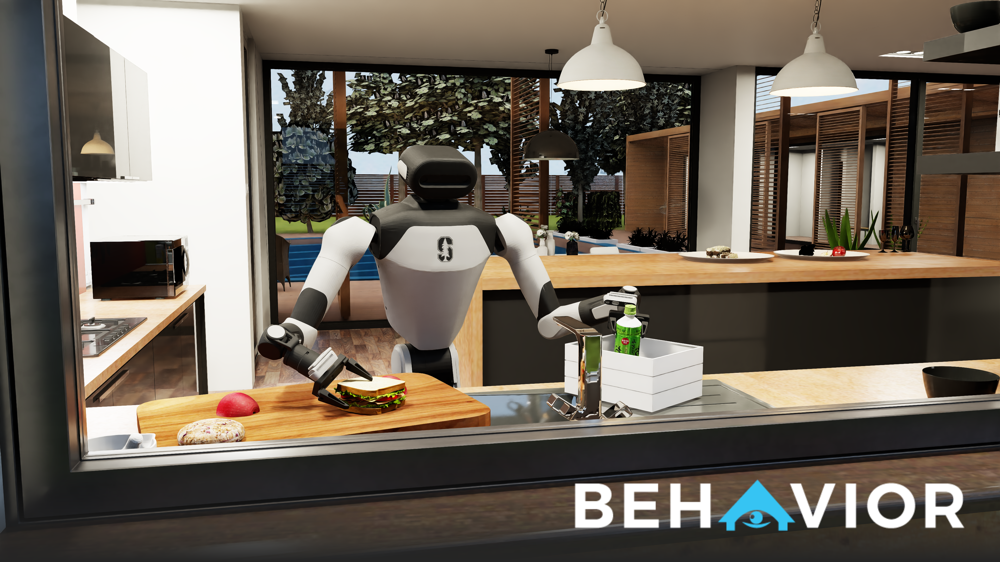

<h1 align="center">BEHAVIOR-1K</h1>



**BEHAVIOR-1K** is a comprehensive simulation benchmark for testing embodied AI agents on 1,000 everyday household activities. This monolithic repository provides everything needed to train and evaluate agents on human-centered tasks like cleaning, cooking, and organizing — activities selected from real human time-use surveys and preference studies.

***Check out our [main website](https://behavior.stanford.edu/) for more details!***

## DeltaSG Extension

本仓库包含 DeltaSG 的 Env-A / Env-B / Env-C 任务实例生成、专家回放、摄像头可视化、
审计与多场景批处理工具。项目使用方法、运行约束、实时进度命令和验收口径见
[DeltaSG 中文使用手册](docs/deltasg_usage.md)。经过验收的检索、着火任务步骤图和
全局相机画面见
[可视化示例](docs/deltasg_usage.md#已验收的可视化示例)。数据维护者将验收结果发布到
`DStardust/EM-STORM` 的最短流程见
[ModelScope 上传说明](docs/deltasg_usage.md#上传-modelscope)。

## EM-STORM Training

训练代码独立维护在 `training/emstorm-qa-sft` 分支，使用 `emstorm-train` 环境，
不依赖 OmniGibson 仿真或在线 LLM API。数据下载、QA 微调、评测、实时进度与断点续跑
见 [训练中文使用说明](README_EMSTORM_TRAINING.md)，场景图训练格式见
[训练设计与实验记录](docs/emstorm_training.md)。本分支不包含数据、模型权重或访问密钥。

# 🛠️ Installation

BEHAVIOR-1K provides an installation script that handles all dependencies and components. The script supports modular installation, allowing you to install only the components you need.

Please check out [Installation Guide](https://behavior.stanford.edu/getting_started/installation.html) for more details!

## 📄 Citation

```bibtex
@article{li2024behavior1k,
    title   = {BEHAVIOR-1K: A Human-Centered, Embodied AI Benchmark with 1,000 Everyday Activities and Realistic Simulation},
    author  = {Chengshu Li and Ruohan Zhang and Josiah Wong and Cem Gokmen and Sanjana Srivastava and Roberto Martín-Martín and Chen Wang and Gabrael Levine and Wensi Ai and Benjamin Martinez and Hang Yin and Michael Lingelbach and Minjune Hwang and Ayano Hiranaka and Sujay Garlanka and Arman Aydin and Sharon Lee and Jiankai Sun and Mona Anvari and Manasi Sharma and Dhruva Bansal and Samuel Hunter and Kyu-Young Kim and Alan Lou and Caleb R Matthews and Ivan Villa-Renteria and Jerry Huayang Tang and Claire Tang and Fei Xia and Yunzhu Li and Silvio Savarese and Hyowon Gweon and C. Karen Liu and Jiajun Wu and Li Fei-Fei},
    journal = {arXiv preprint arXiv:2403.09227},
    year    = {2024}
}
```
