# DeltaSG 数据生成与维护指南

## 程序入口

- `code/online_deltasg.py`：DeltaSG 生成引擎，由命令行入口调用，不建议直接执行。
- `code/run_online_deltasg.py`：单场景生成入口。
- `code/run_enva_multiscene.sh`：Env-A 多场景便捷脚本，默认把总样本数分配到 5 个已验证场景。
- `code/run_batch100_all.sh`：正式批处理入口。它覆盖 Env-A/B/C 的全部 8 个任务标签，对每个标签和场景补齐合格样本、生成可视化，并审计最终接受的样本。
- `code/visualize_deltasg_batch.py`：按官方房间摄像头策略生成 RGB、实例分割和 bbox 结果。
- `code/audit_deltasg_outputs.py`：检查生成结果、场景完整性、重复样本和可视化完整性。

支持的任务标签如下：

| 环境 | 任务类型 |
| --- | --- |
| Env-A | `retrieval_delivery`、`open_close`、`appliance` |
| Env-B | `fire`、`dirty_dishes`、`dirty_clothes`、`broken_object` |
| Env-C | `retrieval_delivery`、`open_close`、`appliance`、`fire` |

## 当前验收状态

截至 2026-09-10，代码仓库中的“完成”分为两级，不能混用：

- 聚焦回归：Env-A 在 `Beechwood_0_int` 已生成 6/6 个不同任务样本且审计无问题；
  对这 6 个样本使用当前专家实现回放，5/6 通过（83.3%，失败项为
  `deliver_drink` 的官方 `OnTop` 终态）；
  Env-B fire 在 `Ihlen_1_int` 已生成 3/3、专家接受 3/3，并验证官方
  `OnFire=False`、场景完整性、摄像头和步骤图片。
- Env-B 15 场景回归生成 46/60（76.7%），专家接受 37/46（80.4%）；其中 fire
  9/9、dirty clothes 16/18、broken cleanup 10/14、dirty dishes 2/5。该结果验证了
  已生成样本的专家通过率，但请求槽位端到端产出率为 37/60（61.7%），还不能标记为
  全场景发布门禁完成。
- 位置多样性聚焦回归在 `Beechwood_0_int` 连续生成 fire 3/3；6 个新增物体得到
  6 个不同的“类别+房间+25 cm 位置”组合，零重复指纹、零审计问题。
- 全覆盖发布：必须再通过 15 场景、全部任务/物品覆盖审计。聚焦回归通过不等于该门禁
  已完成，批量发布时仍应按“全任务批处理”一节执行并保留审计报告。

`code/outputs` 下的原始数据不提交 Git；仓库只保存必要代码、手册和少量经过人工核验的
示例图。这样可以复核行为，又不会把大型训练数据混入源码历史。

本次上传前的最终相机门回归位于本机
`code/outputs/release_camera_score_final_20260909_143339`：Env-A 生成 1/1、审计 1/1，
三台全局相机依次使用 `official_preferred_target_aim`、`official_wall_SE_NE_45` 和
`official_corner_SE_20`，有效内容投影量分别为 466208、608502 和 873668 像素。
第三台位于非目标厨房并拍到冰箱、烤箱、水槽和多组柜体；三台相机均通过非结构物体
内容质量门。它们的位姿与本手册下方三张 1280x720 原始画面逐项一致（最大数值差
为 0），日志也明确淘汰了多个纯墙/空内容候选。另一个随机 fire 冒烟样本在前三次
物理放置或机器人稳定性检查失败后由有界重试生成成功；失败尝试没有写入数据集。
这说明过滤和续跑生效，但该单样本不能替代多场景成功率统计。

## 运行约束

OmniGibson 必须使用单张 GPU。仅对 OmniGibson 子进程取消代理，不要在当前 shell 中全局取消代理：

```bash
DELTASG_GPU=0 PYTHONUNBUFFERED=1 \
  code/run_omnigibson_single_gpu.sh \
  conda run --no-capture-output -n behavior \
  python code/run_online_deltasg.py ...
```

LLM 是生成和验证流程的一部分。运行前设置 DashScope 密钥：

```bash
export DASHSCOPE_API_KEY='<your-key>'
```

默认模型是 `qwen3.8-max`。单次 Python 入口可以显式指定：

```text
--llm-model qwen3.8-max
```

批处理脚本可通过环境变量统一替换为其他 DashScope 兼容模型：

```bash
export DELTASG_LLM_MODEL='<model-name>'
```

较便宜的模型可用于开发和小规模回测，但不同模型的计划合法率可能不同；正式数据集应在 manifest 中保留实际的 `llm_model`，并分模型审计成功率。

仓库不保存 API 密钥。可选的兼容接口地址通过 `LLM_BASE_URL` 设置。
`code/run_omnigibson_single_gpu.sh` 会加载当前工作树根目录的 `.env`，再仅对
OmniGibson 子进程取消代理；可通过 `DELTASG_ENV_FILE` 显式指定另一个项目内
环境文件。不要从其他项目的 `.env` 读取密钥。

## 单场景生成

下面的命令在 `Beechwood_0_int` 生成 10 个 Env-A retrieval/delivery 样本：

```bash
DELTASG_GPU=0 PYTHONUNBUFFERED=1 \
  code/run_omnigibson_single_gpu.sh \
  conda run --no-capture-output -n behavior \
  python code/run_online_deltasg.py \
    --scene Beechwood_0_int \
    --robot fetch \
    --env-type A \
    --task-categories retrieval_delivery \
    --allow-repeat-tasks \
    --num-envs 10 \
    --llm-model qwen3.8-max \
    --min-placement-diversity-distance 0.50 \
    --output-dir code/outputs/enva_beechwood \
    --seed 1000
```

`--allow-repeat-tasks` 允许重复抽取任务类别，不允许生成完全相同的样本。样本指纹包含初始场景、任务、房间、物品、承接面和毫米级舍入后的位置；相同物品放在不同合理位置会被视为不同样本。

## 放置位置多样性

`--min-placement-diversity-distance` 默认是 `0.50` 米，适用于 Env-A/B/C。每个成功
样本会把所有新生成物体的实际位置写入 `diversity.placement_records`，包括类别、模型、
语义角色、房间、承接面、放置模式、XY 坐标和 25 cm 位置分桶。后续样本按以下顺序选点：

1. 先执行生活布局、承接面容量、物体 footprint、碰撞、机器人可达性和操作高度检查。
2. 在通过上述检查的候选中，按物品类别分别对同房间的地面位置或同一承接面的桌面
   位置执行 maximin 选择，优先选择离同类物品历史位置至少 0.50 米的点。扫把、垃圾桶
   等不同类别不会互相挤占多样性距离预算。
3. 同一物体预先生成的三个地面回退候选也互相避让。
4. 紧凑房间或小桌面无法满足 0.50 米时，选择最远的合法候选；不会为满足多样性而
   穿过墙体、碰撞家具或降低可达性门槛。

连续生成必须在同一个模拟器进程中运行，或使用 `--resume` 加载原输出目录的
`checkpoint.json`，才能继承前序位置历史。不同场景使用各自的坐标历史，不把两个场景的
世界坐标混在一起。完全相同的样本仍会由 `sample_fingerprint` 硬拒绝。
复用的场景原生家具或容器不属于新生成放置，不写入该位置历史，也不计入位置多样性
汇总；它们仍保留在任务对象和样本指纹中。被操作或作为任务目的地的原生物必须先通过
机器人接近距离和操作高度门禁，否则改为生成并验证替代物，不能直接记为合格。

查看一个样本记录的位置：

```bash
jq '.diversity.placement_records' code/outputs/<run>/online_env*.json
```

初始摄像头布置使用官方相机内参、视锥投影与 PhysX 射线遮挡检查。系统先检查
机器人头部主相机，再针对仍不可见的任务物品，在其所在房间按官方墙角/墙面相机
策略布置 2-3 台全局相机。所有任务物品必须至少被一台全局相机覆盖，机器人也必须
至少被一台全局相机覆盖。约 50% 的样本请求第三视角；该视角可以在非目标房间，
但每台全局相机都必须拍到达到最小投影面积的家具、任务物或机器人；门、窗、开关和
墙饰不能单独让补充相机通过。纯墙面、天空或空画面候选会在生成阶段被拒绝。JSON 的 `validation.camera_coverage` 和每条相机记录会保存
可见物体、像素量及 `scene_content_quality_ok`。达到相机上限、无法解析物品房间，
或没有足够的内容合格视角时，样本会被拒绝并重试。

## Env-A 多场景

`run_enva_multiscene.sh` 的 `NUM` 是所有场景合计的目标数量，不是每个场景的数量。默认场景列表有 5 个，这只是便捷脚本的默认验证集合，不代表 OmniGibson 只有 5 个初始场景。

```bash
NUM=100 \
TASK_CATEGORIES='retrieval_delivery,open_close,appliance' \
VISUALIZE=1 \
bash code/run_enva_multiscene.sh code/outputs/enva_multiscene
```

可通过 `SCENES` 显式覆盖场景：

```bash
SCENES='Beechwood_0_int Ihlen_0_int Merom_0_int' \
NUM=30 \
bash code/run_enva_multiscene.sh code/outputs/enva_selected
```

## 全任务批处理

正式批量任务应在 `tmux` 中启动。默认情况下，脚本通过 `code/list_deltasg_scenes.py` 发现本机安装的全部室内场景，并将 `NUM` 个目标样本分配给各场景。`MIN_OK_PER_SCENE` 保证每个场景和任务标签至少具有指定数量的合格样本。每个标签都会补齐严格合格的样本，而不是简单执行固定次数。

```bash
RUN_ID="$(date +%Y%m%d_%H%M%S)"
OUT="code/outputs/batch100_all_${RUN_ID}"
tmux new-session -d -s "deltasg_${RUN_ID}" \
  "cd '$PWD' && NUM=100 MIN_OK_PER_SCENE=1 \
   STRICT_COVERAGE=1 REQUIRE_ALL_ASSET_MODELS=1 REQUIRE_ALL_NATIVE_TARGETS=1 \
   bash code/run_batch100_all.sh '$OUT' \
   >> '$OUT.master.log' 2>&1"
```

常用覆盖参数：

- `TASK_OBJECTS` / `CONTEXT_OBJECTS`：控制单个任务实例中任务物品和上下文物品的目标数量；正式多物品回测可使用 `TASK_OBJECTS=2 CONTEXT_OBJECTS=1`。
- `VISUALIZE_INCREMENTAL=1`（默认）：每个场景和任务标签补齐目标样本后立即生成图片与 bbox，而不是等待全部生成任务结束。

```bash
# 只跑指定场景和标签
SCENES='Beechwood_0_int Merom_0_int' \
LABELS='envA_retrieval_delivery,envB_all' \
NUM=20 \
bash code/run_batch100_all.sh code/outputs/smoke

# 枚举将要使用的初始场景
DELTASG_GPU=0 code/run_omnigibson_single_gpu.sh \
  conda run --no-capture-output -n behavior \
  python code/list_deltasg_scenes.py --scope interior
```

查看运行进度：

```bash
tmux ls
tmux attach -t <session-name>
tail -f <output-root>.master.log
find <output-root> -name 'online_*.json' | wc -l
```

批处理结束时会生成：

- `audit_accepted.json`：样本内容、物理稳定性、重复和 bbox 审计。
- `coverage_inventory.json`：本机已安装的任务资产类别和模型清单。
- `coverage_audit.json`：全场景 × 全任务标签矩阵、任务变体、目标类别、模型和原生目标实例覆盖报告。

`STRICT_COVERAGE=1` 要求每个启用任务族的已知任务变体至少出现一次。
`REQUIRE_ALL_ASSET_MODELS=1` 要求 retrieval/fire 使用的已安装任务资产模型全部出现。生成器会优先调度尚未覆盖的任务、模型和场景原生目标，直到数量上限；任何剩余缺口都会使脚本非零退出并写入 `failed_jobs.tsv`。小规模冒烟测试可显式设置这两个变量为 `0`，但这种结果不能标记为全覆盖数据集。
`REQUIRE_ALL_NATIVE_TARGETS=1` 还要求所有与任务状态兼容的门、窗、柜体、冰箱、开关、电器和可燃原生实例至少成为一次真实任务目标。

Env-A 当前可执行闭环为 23 个任务名：9 个 retrieval/delivery、8 个 open/close、6 个 appliance。研究 taxonomy 中的 `retrieve_remote`、`put_object_on_table`、`put_object_in_container` 尚无完整物理资产/目标契约，不计入当前全覆盖结果。

真实 floor 高度正反例回归使用 `code/run_enva_floor_height_regression.sh <output-root>`：竖立水瓶必须通过生成和 oracle expert，低矮手机必须留下 `task_object_floor_height_out_of_range` 证据，不能生成成功样本。

场景或资产版本升级后，用已有干净样本中的完整 `before_graph` 刷新原生目标配置：

```bash
python code/build_enva_native_eligibility.py \
  --input-root code/outputs/<multiscene-run> \
  --output code/configs/env_a_native_eligibility.json
```

工具要求 15 个版本化场景均有图，并且每个场景至少存在一个高度合格的 open/close 和 appliance 目标族，否则非零退出。

具体模型连续两次放置失败后会在当前断点中暂停调度，避免一个坏资产造成无限重试；它不会从覆盖清单中消失，因此最终覆盖审计仍会报告该模型缺失。应修复模型或放置策略后续跑，而不是降低审计标准。

## Env-B 异常任务

Env-B 的正式标签是 `envB_all`，包含四类异常：

| `--env-b-types` | 异常证据 | 解决路径 |
| --- | --- | --- |
| `fire` | 官方 `OnFire=True` + `code/assets/Flame_Animation.usdz` 动画火焰 | `fire_extinguisher` |
| `dirty_dishes` | 官方 `Covered(stain)=True` | 原生 dishwasher，或 sink + faucet + sponge + dish soap 的完整手洗流程 |
| `dirty_clothes` | 官方 `Covered(dirt)=True` | 原生 washer，或 hamper / basket |
| `broken_object` | `broken_glass` / `broken_light_bulb` 真实破损资产 | 完整的 broom + dustpan + trash can |

火焰的任务状态仍由 OmniGibson 官方 `OnFire` 管理。生成器只关闭其原有 Flow
显示器，并按 `demo_flame_rs_int_backup.py` 的材质、朝向、缩放和光源逻辑加载
仓库内 USDZ；可视化和专家回放会从样本记录重建同一个效果。灭火后移除火焰，
烟雾可作为灭火后的短时残留继续存在；开始下一个任务前会清理旧火焰，避免跨样本重影。
这不是 marker，也不以图片效果代替官方状态验证。

单场景四类各生成一个样本：

```bash
DELTASG_GPU=0 code/run_omnigibson_single_gpu.sh \
  conda run --no-capture-output -n behavior \
  python code/run_online_deltasg.py \
    --scene Ihlen_1_int --robot Tiago --env-type B \
    --env-b-types fire,dirty_dishes,dirty_clothes,broken_object \
    --allow-repeat-tasks --num-envs 4 \
    --min-global-cameras 2 --max-global-cameras 3 \
    --llm-model qwen3.8-max \
    --output-dir code/outputs/envb_all_rs_int
```

`dirty_dishes` 会先从完整场景图选择原生 dishwasher，或绑定同一房间内的
sink + faucet，再把机器人出生点限制到该基础设施 1.15 m 操作范围内；不会因为
一次随机出生点落在其他连通分量就错误判定 recipe 不可用。其余 recipe 无基础
设施要求并生成整套解决物品。hamper、basket、trash can 等任务终点会先按官方
资产元数据过滤不可操作尺寸，落地后仍必须通过实时 AABB 高度和导航检查。
数据中的 `cloth_basket` 请求会显式记录为 `wicker_basket` 资产替换，因为当前
BEHAVIOR 资产库没有 `cloth_basket` 类别。替换后的资产是可填充篮筐，因此衣物
必须通过官方 `Inside=True` 预检和专家终态验证，不使用篮沿不稳定的 `OnTop`。

手洗样本必须包含以下完整步骤，缺少任一步都会被计划编译器和审计器拒绝：

1. 导航到脏餐具并抓取。
2. 导航到水槽，将餐具以官方 `Inside=True` 放入水槽。
3. 导航到水龙头，以官方 `ToggledOn=True` 打开水。
4. 导航到海绵并抓取。
5. 导航回水槽，在餐具仍位于水槽且水龙头开启时执行擦洗。
6. 以官方 `Covered(stain)=False` 验证污渍已去除。
7. 导航到水龙头，以官方 `ToggledOn=False` 关闭水。

生成 JSON 中对应 13 条源步骤（每次导航和操作分别保存，其中包括把使用后的海绵
放回水槽）。编译器只会合并紧邻的同目标冗余导航，不会删除抓取、放置、擦洗或
状态操作。每一步均保存机器人主视角和 2-3 个全局摄像头的 pre/post RGB 与分割图。
海绵和洗洁精必须放在水槽附近的开放承接面，但不能使用水槽本体作为承接面，也
不能紧贴脏餐具。餐具进入水槽/洗碗机时首先调用 OmniGibson 官方 `Inside` setter；
若该资产的随机射线采样失败，只允许根据同一资产的官方 `fillable/openfillable`
体积寻找真实 PhysX 承托面。物理步进后必须同时满足沉降位移不超过 3 cm、完整 AABB
仍在官方体积内、官方 `Inside.get_value()` 为真；任一条件失败都拒绝，不能把掉进柜体
内部的物品或伪造状态写入数据集。

对已生成样本执行同一进程的符号专家回放（每一步均保存官方状态变更前后视觉）：

```bash
DELTASG_GPU=0 EXPERT_BACKEND=oracle_symbolic EXPERT_LABELS=all \
  EXPERT_TASKS=all EXPERT_ROBOT=Tiago DELTASG_LLM_MODEL=qwen3.8-max \
  code/run_deltasg_expert_batch.sh \
    code/outputs/envb_all_rs_int \
    code/outputs/envb_all_rs_int_expert 0
```

火灾必须以 `OnFire=False` 结束并移除 USDZ 火焰，灭火器与火源的水平 AABB 边缘
距离必须至少为 2.5 m；手洗必须以官方
`Covered(stain)=False` 结束，衣物和破损物清理必须得到官方 `Inside=True`；
dishwasher / washer 路径还要验证官方 `Open`、`ToggledOn` 状态序列。只有
`expert_result.json` 同时满足 `accepted=true` 与 `qa_eligible=true` 才是专家
端到端合格样本。

### Env-A/B/C 多场景端到端脚本

`code/run_envbc_multiscene_e2e.sh` 按场景串行完成生成、审计和专家回放，避免每个
样本重复冷启动。单个任务失败会记录到日志和 checkpoint，不会阻止后续场景继续
运行；重新执行同一命令时，退出码为 0 的阶段会跳过，失败阶段会从已有 checkpoint
续跑。

```bash
RUN_ID="$(date +%Y%m%d_%H%M%S)"
OUT="code/outputs/envbc_e2e_${RUN_ID}"
tmux new-session -d -s "envbc_${RUN_ID}" \
  "cd '$PWD' && DELTASG_GPU=0 DELTASG_LLM_MODEL=qwen3.8-max \
   SCENES='Ihlen_1_int Beechwood_0_int' \
   ENVA_NUM=0 ENVB_NUM=8 \
   ENVB_TYPES='fire,dirty_dishes,dirty_clothes,broken_object' \
   ENVC_NUM=0 RUN_EXPERT=1 \
   MIN_PLACEMENT_DIVERSITY_DISTANCE=0.50 \
   bash code/run_envbc_multiscene_e2e.sh '$OUT' \
   > '$OUT.console.log' 2>&1"
```

其中 `ENVA_NUM`、`ENVB_NUM`、`ENVC_NUM` 是每个场景的请求数量。只验证 fire 时
可设 `ENVB_TYPES=fire`；不设置 `SCENES` 时使用
`code/configs/env_a_scenes.txt` 中的场景。脚本通过
`code/run_omnigibson_single_gpu.sh` 保证每个 OmniGibson 子进程只看到一张 GPU，
并且只在子进程内取消代理。`config.json` 会记录实际使用的模型、每场景请求数、任务类型和
`min_placement_diversity_distance`，发布数据时应与审计报告一并保留。

实时查看生成数和专家端到端接受率：

```bash
python code/monitor_envbc_multiscene_e2e.py "$OUT"
tail -f "$OUT"/*/logs/envb.log
tail -f "$OUT"/*/expert/logs/persistent_worker.log
```

结束后每个场景包含 `generation_audit.json`、专家目录和独立退出码；总览写入
`final_report.txt`。生成成功不能代替专家成功，只有监控表中的 `accepted` 才表示
专家结果同时通过 `accepted=true` 和 `qa_eligible=true`。

## 可视化与审计

可视化使用正常物体放置结果和官方摄像头策略，不依赖 marker：

```bash
DELTASG_GPU=0 code/run_omnigibson_single_gpu.sh \
  conda run --no-capture-output -n behavior \
  python code/visualize_deltasg_batch.py \
    --scene Beechwood_0_int \
    --robot none \
    --input-dir code/outputs/enva_beechwood \
    --output-dir code/outputs/enva_beechwood_vis
```

审计已接受样本：

```bash
python code/audit_deltasg_outputs.py \
  --root <output-root> \
  --vis-root <output-root>/visualizations \
  --ok-only \
  --json-out <output-root>/audit_accepted.json \
  --fail-on-issues
```

位置多样性汇总直接读取审计 JSON：

```bash
jq '.diversity_summary' <output-root>/audit_accepted.json
```

- `placement_position_records`：参与统计的新增物体放置记录总数。
- `unique_category_room_position_bins_25cm`：类别、房间和 25 cm 位置组合的唯一数。
- `repeated_category_room_position_records`：落入既有组合的记录数；正式批次应结合房间
  尺寸解释该值，并同时确认 `duplicate_fingerprint_groups` 为空。

只有同时满足生成成功、初始场景完整、物理稳定、非重复且可视化审计通过的样本，才应进入训练数据集。生成输出和大批量图像不提交到 Git；应作为带 manifest 和审计报告的 release artifact 或外部数据集发布。

## 已验收的可视化示例

以下第一组图片来自同一个已通过的 `Beechwood_0_int` 检索专家样本，展示初始状态、
导航后的机器人视角和抓取后的双视角。第二组来自同一个 `Ihlen_1_int` fire 专家样本。
全部为原始 640x480 渲染，没有 marker 或后期合成。

| 检索任务初始全局视角 | 导航到药瓶后的机器人视角 |
| --- | --- |
| 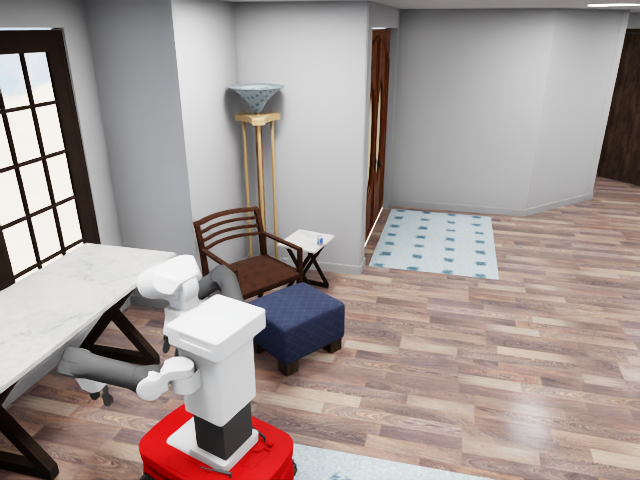 | 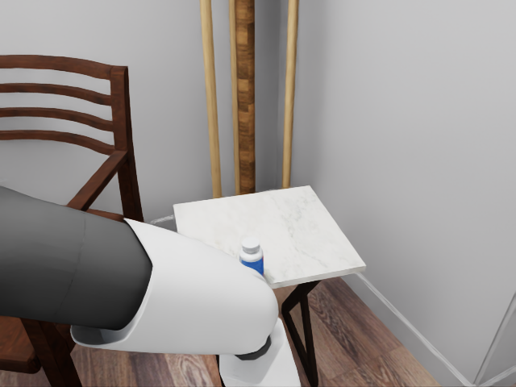 |

| 抓取药瓶后的全局视角 | 抓取后的机器人视角 |
| --- | --- |
| 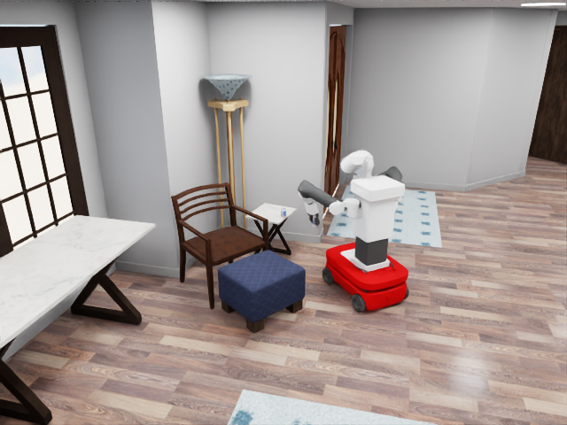 | 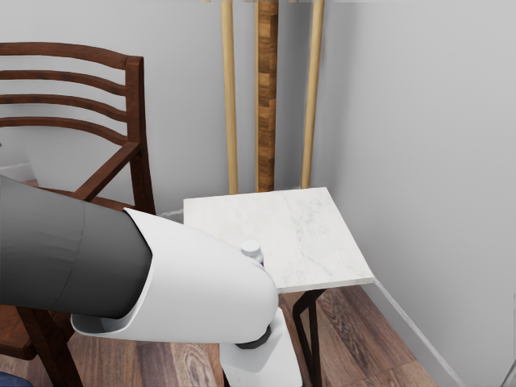 |

检索样本的 `expert_result.json` 为 `accepted=true`。下面 fire 的第 1、2、4 张为
全局摄像头，第 3 张为机器人主视角。

| 初始火焰与上升烟柱 | 抓取远处灭火器后 |
| --- | --- |
| 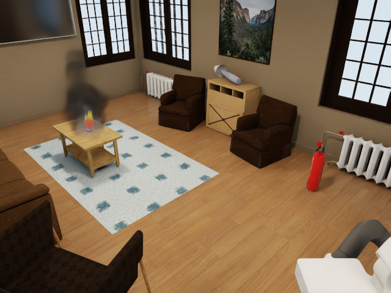 | 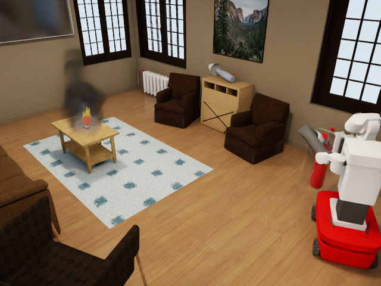 |

| 机器人视角中的灭火器 | 官方灭火状态变更后 |
| --- | --- |
| 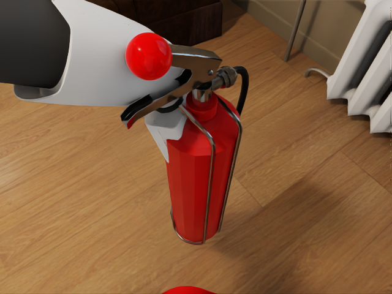 | 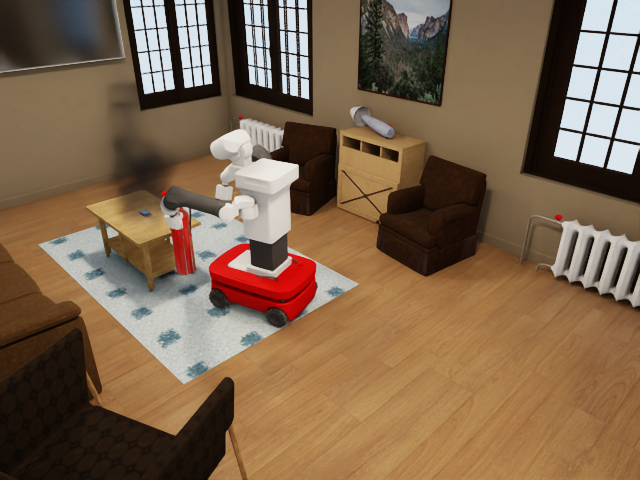 |

对应结果的生成与专家审计均为 3/3。灭火前使用仓库内
`code/assets/Flame_Animation.usdz` 与 OmniGibson Flow 烟雾；灭火后移除火焰，短时烟雾
允许保留。下一个持久化样本开始前会清理上一个样本的火焰效果。

### 全局摄像头画面核验

以下三张为同一个样本记录的原始 1280x720 全局相机输出。前两张在目标客厅，均看到
任务药瓶；第三张按指南放在非目标厨房，不要求看到任务物或机器人，但清楚覆盖实际
家具和电器。相机候选选择先比较可见有效物体数量，再以投影面积排序，避免近墙物体的
重叠 AABB 像素把半墙画面错误排到首位。

| 目标房间主视角 | 目标房间第二视角 |
| --- | --- |
| 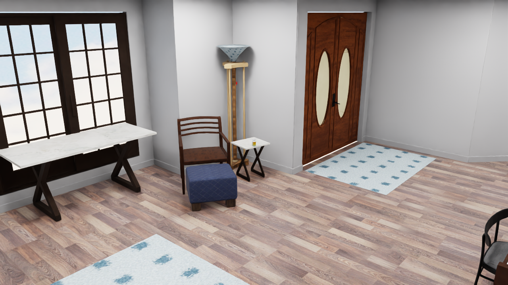 | 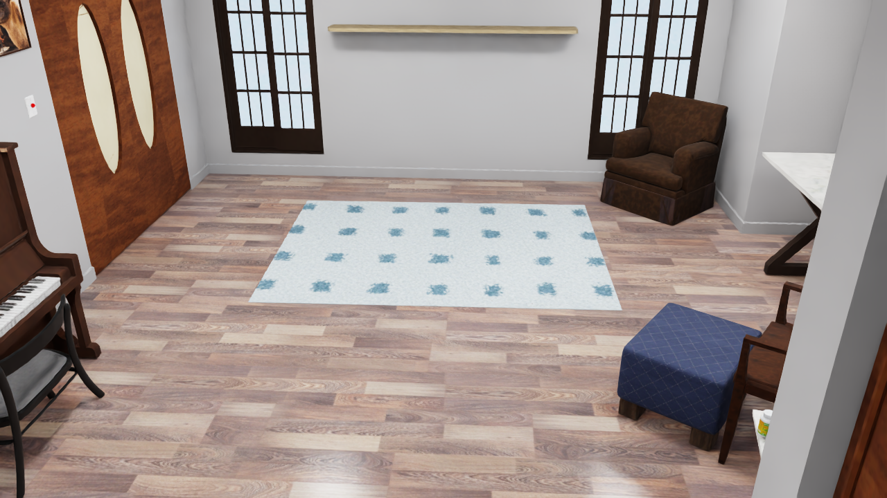 |

| 非目标厨房补充视角 |
| --- |
| 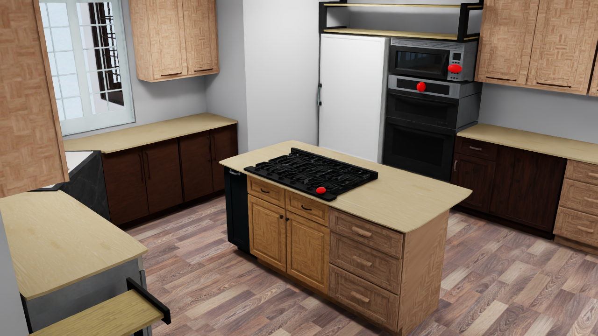 |

## 常见错误

### Orientation mismatch between entity prim and root link

该断言来自 OmniGibson 的停止态 `EntityPrim.set_position_orientation()`。部分官方场景中的关节物体，其 entity prim 与 root link 初始朝向并不完全相同；在机器人出生点重试时，如果停止仿真后逐个恢复这些原生物体，就会触发断言。

当前实现会在 PhysX 运行态恢复原生场景物体，仅在停止态设置 Fetch 位姿，然后重新启动仿真。出现此错误时先拉取最新代码，不要通过移动或删除原场景物体规避。

### 没有生成结果

场景首次加载可能需要数分钟。先检查 tmux、日志和 GPU 进程，再确认 `DASHSCOPE_API_KEY` 已传入子进程。不要因为初始化阶段没有 JSON 就并行启动第二个 OmniGibson 进程。
